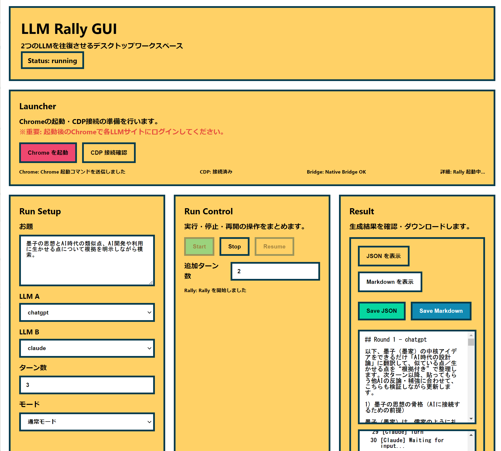

# llm-rally



Playwrightを使って、2つのLLMチャットUIを自動で往復させるツールです。

## 機能

- 2つのLLMチャットUI間で自動的に質問と回答を往復
- 各ターンの入出力をJSONファイルに記録（タイムスタンプ付きファイル名）
- セッション保存によるログイン状態の維持
- 詳細なログ出力でデバッグしやすい
- 複数のLLMサイトに対応（ChatGPT、Grok、Claude、Gemini）
- 高速な回答検知（ストリーミング状態監視、500msポーリング）

## GitHubからダウンロードして使う

このリポジトリを **GitHubの「Download ZIP」** で取得し、そのまま利用できます。
※ macOS はリリース版を用意しないため、同様に GitHub から ZIP をダウンロードして本READMEの手順でセットアップしてください。

### 前提
- Node.js（LTS推奨）
- Google Chrome（CDPモードで利用）

### 初回セットアップ（最初の一回だけ）

- Windows: `install.bat` をダブルクリック
- macOS: `install.command` をダブルクリック
  - もし実行できない場合は、右クリック → 「開く」 を試してください。

この処理で以下がまとめて行われます:
- ルートの `npm install`
- `gui/` の `npm install`
- `npx playwright install`

### 起動

- Windows: `start_gui.bat` をダブルクリック
- macOS: `start_gui.command` をダブルクリック
  - もし実行できない場合は、右クリック → 「開く」 を試してください。


## 初回ログイン（推奨: CDPモード）

**start_chrome を使用（推奨）**
```bash
# Windows
start_chrome.bat

# macOS
./start_chrome.command

# 2. 開いたタブ（ChatGPT, Claude, Grok）で手動ログイン

# 3. ログイン完了後、そのまま実行可能
node rally.mjs --cdp http://127.0.0.1:9222 --rounds 3 --a chatgpt --b claude
```

**login-onlyモード**
```bash
node rally.mjs --login-only
```
開いた2つのタブで手動ログインし、完了したらブラウザを閉じます。
ログイン情報は `pw-profile` ディレクトリに保存されます。

## GUI版の使い方

直感的な操作が可能なデスクトップアプリ版も利用可能です。

### 操作手順
1. **Launcher**: 「Chromeを起動」ボタンを押します。
2. **ログイン**: 起動したChromeで、使用したいLLMサイト（ChatGPT, Claude, Grokなど）に手動でログインします。
   - ⚠️ **重要**: アプリから操作するためには、ログイン状態が必要です。
3. **接続確認**: ログインして準備ができたら、アプリが自動的にChromeを認識し、パネルが有効化されます。
4. **Run Setup**: 
   - お題: ディスカッションのテーマを入力
   - LLM A/B: 対戦させるAIを選択
   - ターン数: 往復回数を指定
   - モード: 会話のスタイル（通常、討論、共創など）を選択
5. **Run Control**: 「Start」ボタンで対話を開始します。

※ 実行中はリアルタイムでログが表示され、終了後は「Result」タブでMarkdown/JSON形式の結果を確認・コピーできます。

## CLI版の使い方

### 1. シードファイルの準備
`seed.txt` に最初の質問を書きます。
```bash
echo "AIの登場で、日本の義務教育以後の教育はどうなるだろうか。" > seed.txt
```

### 2. 実行

**CDPモード（推奨）**
```bash
# Chromeを起動（初回のみ）
start_chrome.bat

# 実行
node rally.mjs --cdp http://127.0.0.1:9222 --rounds 3 --a chatgpt --b claude --first chatgpt
```

**自動起動モード**
```bash
node rally.mjs --rounds 5 --a chatgpt --b grok --first chatgpt
```

## ブラウザオプション

既定のブラウザを使う場合:
```bash
node rally.mjs --default-browser
```

Chrome DevTools (CDP) で起動済みのChromeに接続する場合:
```bash
node rally.mjs --cdp http://127.0.0.1:9222
```
※ `start_chrome` でChromeを起動すると、ポート9222でCDP接続可能になります。

任意のブラウザを指定する場合:
```bash
node rally.mjs --browser chromium
node rally.mjs --browser firefox
node rally.mjs --browser webkit
node rally.mjs --browser chromium --channel chrome   # インストール済みChrome
node rally.mjs --browser chromium --channel msedge   # インストール済みEdge
```

### オプション
- `--a <サイト名>`: サイトA（デフォルト: chatgpt）
- `--b <サイト名>`: サイトB（デフォルト: grok）
- `--first <サイト名>`: 最初に質問するサイト（デフォルト: chatgpt）
- `--rounds <数>`: 往復回数（デフォルト: 5）
- `--out <ファイル名>`: 出力ファイル（デフォルト: `logs/YYYYMMDD_HHmmss.json`）
- `--seed-file <ファイル名>`: シードファイル（デフォルト: seed.txt）
- `--cdp <URL>`: CDP接続先URL（例: http://127.0.0.1:9222）
- `--login-only`: ログインのみ実行

### 対応サイト
- `chatgpt`: ChatGPT (https://chatgpt.com/)
- `grok`: Grok (https://grok.com/)
- `claude`: Claude (https://claude.ai/)
- `gemini`: Gemini (https://gemini.google.com/)

## 出力

実行結果は `logs/YYYYMMDD_HHmmss.json` に保存されます（タイムスタンプ付き）。
`--out` オプションで任意のファイル名も指定可能です。

```json
[
  {
    "ts": "2026-01-01T00:00:00.000Z",
    "type": "meta",
    "a": "chatgpt",
    "b": "claude",
    "first": "chatgpt",
    "rounds": 3
  },
  {
    "ts": "2026-01-01T00:00:00.000Z",
    "type": "seed",
    "text": "質問内容..."
  },
  {
    "ts": "2026-01-01T00:00:05.000Z",
    "type": "turn",
    "round": 1,
    "who": "chatgpt",
    "input": "質問内容...",
    "output": "回答内容..."
  }
]
```

## トラブルシューティング

### セレクタが見つからない
サイトのUIが変更された可能性があります。

**セレクタテストツールを使用:**
```bash
# Chromeを起動
start_chrome.bat

# セレクタをテスト
node test-selectors.mjs --site claude --cdp http://127.0.0.1:9222
```

問題があれば `sites.json` のセレクタを更新してください。

### タイムアウトエラー
ネットワークが遅い場合や、LLMの応答が非常に長い場合（特にo1などの思考型モデル）に発生することがあります。

現在のタイムアウト設定（v0.2.0時点）:
- 応答開始待機: 10分 (600秒) - 思考時間が長いモデルに対応
- 生成完了待機: 15分 (900秒) - 長文生成に対応

※ これらを超えても応答がない場合は、処理を中断してエラーとなります。その場合、Resume機能を使って再開することを推奨します。

### ログインが保持されない
`pw-profile` ディレクトリが削除されている可能性があります。
再度 `--login-only` でログインするか、`start_chrome` でChromeを起動してログインしてください。

### CDPモードで接続できない
1. すべてのChromeウィンドウを閉じる
2. `start_chrome` を実行してChromeを起動
3. `node rally.mjs --cdp http://127.0.0.1:9222 ...` を実行

## カスタマイズ

### 新しいサイトの追加
`sites.json` に新しいエントリを追加します。
```json
{
  "mysite": {
    "name": "My LLM Site",
    "url": "https://example.com/",
    "selectors": {
      "input": "textarea.input",
      "sendButton": "button.send",
      "lastMessage": ".message",
      "stopButton": "button.stop"
    }
  }
}
```

**注意**: `lastMessage` セレクタには `:last-of-type` を**使わないでください**。
Playwrightの `.last()` メソッドで最後の要素を取得します。

セレクタの見つけ方:
1. サイトを開く
2. 開発者ツール（F12）を開く
3. 要素を選択して、適切なセレクタをコピー
4. `test-selectors.mjs` でテスト

## ファイル構成

```
llm-rally/
├── install.bat         # 初回セットアップ（Windows）
├── install.command     # 初回セットアップ（macOS）
├── rally.mjs           # メインスクリプト
├── sites.json          # サイト設定（セレクタ）
├── seed.txt            # シード質問
├── start_chrome.bat    # Chrome起動スクリプト（Windows）
├── start_chrome.command# Chrome起動スクリプト（macOS）
├── start_gui.bat       # GUI起動スクリプト（Windows）
├── start_gui.command   # GUI起動スクリプト（macOS）
├── test-selectors.mjs  # セレクタテストツール
├── logs/               # ログ出力ディレクトリ
└── pw-profile/         # Playwrightプロファイル（ログイン状態）
```

## ライセンス
MIT

